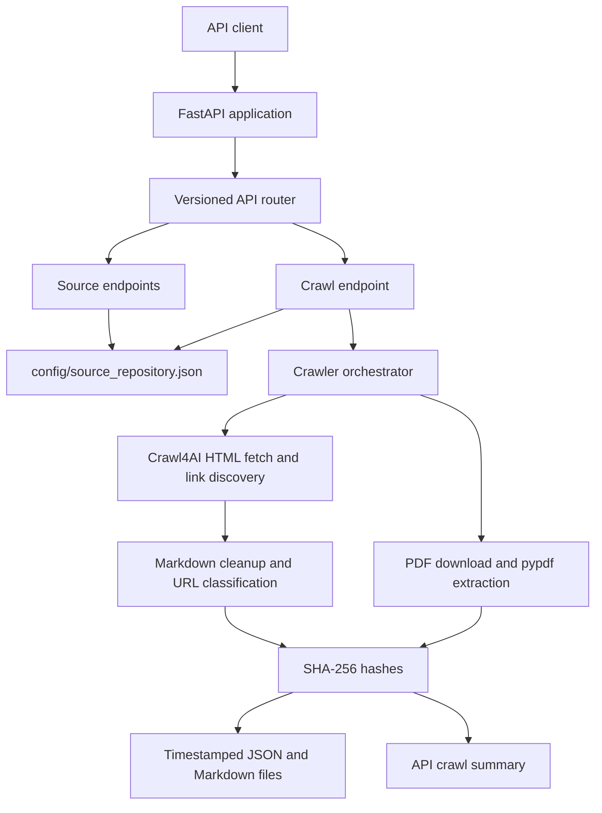
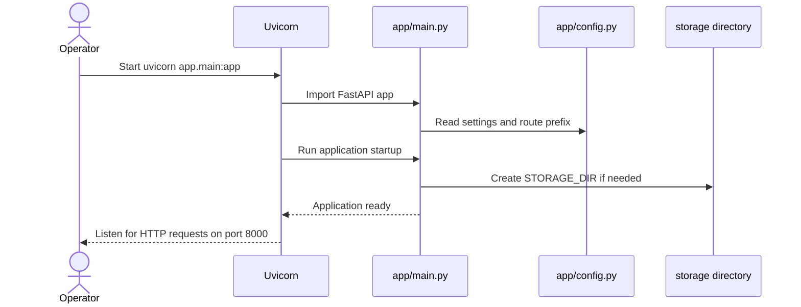
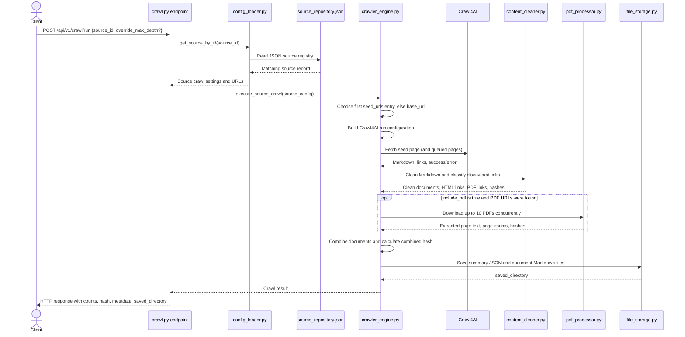

# TLD Regulatory Monitoring Crawler

A FastAPI service for fetching configured government regulatory pages, extracting readable Markdown and PDF text, hashing the extracted content, and saving crawl artifacts to disk. Sources and crawl options are stored in `config/source_repository.json`.

## What it does

For a requested source, the service:

1. Looks up the source record by `source_id` in the JSON registry.
2. Uses its first `seed_urls` entry (or `base_url` when there are no seeds) as the crawl starting point.
3. Fetches HTML with Crawl4AI and cleans its Markdown output. If link following is enabled, it discovers same-domain HTML pages up to the configured depth. It also identifies PDF links.
4. When PDF processing is enabled, downloads up to 10 discovered PDFs concurrently and extracts text page by page with `pypdf`.
5. Calculates SHA-256 hashes for each document and for the combined content.
6. Writes a crawl summary and one Markdown file per extracted document under `storage/extracted_content/<source_id>/<timestamp>/`.
7. Returns a crawl summary through the API.

The service runs a crawl only when `/api/v1/crawl/run` is called. The `monitoring.frequency` field describes source metadata; this repository does not include a scheduler or automatic change-alerting workflow.

## Architecture



## Detailed runtime walkthrough

There are two separate flows: starting the web service, and asking it to crawl a source. Starting the service makes the API available; it does not start a crawl by itself.

### 1. Start the service

Run `uvicorn app.main:app --host 0.0.0.0 --port 8000` from the project root. Uvicorn imports `app.main` and serves its `app` object. FastAPI runs the lifespan startup handler, which logs the service start and creates the configured output directory (`storage/extracted_content` by default). The service then waits for HTTP requests.



### 2. Send the crawl input

Send a `POST` request to `/api/v1/crawl/run` with a JSON body containing a registered `source_id`. Optionally include `override_max_depth` (1–5). For example:

```json
{
  "source_id": "us-tx-health-safety-code",
  "override_max_depth": 2
}
```

This request first passes through the versioned router in `app/api/router.py`, then reaches `app/api/v1/endpoints/crawl.py`. FastAPI checks the body against `CrawlRequest` in `app/schemas/crawl.py`. An invalid request is rejected during request validation. The endpoint asks `app/services/config_loader.py` to find the matching record in `config/source_repository.json`. If there is no matching ID, the endpoint returns HTTP `404`.

When `override_max_depth` is provided, the endpoint replaces the configured `crawl.max_depth` on the loaded source record for this request, then calls `execute_source_crawl` in `app/services/crawler_engine.py`.

### 3. Follow the crawl through the code



In order, the crawler engine:

1. Reads the source's `source`, `crawl`, and `status` configuration. It selects the first item in `source.seed_urls`; if the list is empty it falls back to `source.base_url`.
2. Creates a Crawl4AI configuration, including timeouts, optional wait/target selectors, and boilerplate exclusions. On Windows, crawler execution is moved to a Proactor event loop thread when needed for browser subprocess support.
3. Opens an asynchronous Crawl4AI browser session and fetches the selected URL. A failed seed fetch stops the crawl and becomes an HTTP `500` response. Failed later pages are logged and skipped.
4. Cleans each successful page's Markdown in `content_cleaner.py`, adds a title and source URL header, and calculates a SHA-256 hash for that page.
5. Reads links reported by Crawl4AI. URLs are made absolute, fragments are removed, and links outside the configured `allowed_domains` are ignored. PDF links are collected. HTML links are queued only when `follow_links` is true and the current page has not reached `max_depth`. The seed has depth 1.
6. If `include_pdf` is true, sends up to 10 discovered PDF URLs to `pdf_processor.py`. That module downloads each PDF with `httpx`, extracts text page by page with `pypdf`, and hashes the resulting Markdown. A PDF failure is logged and skipped.
7. Combines HTML and PDF records, calculates a hash across their concatenated content, and calls `file_storage.py` to save the run.
8. Returns the result to the endpoint. The endpoint sends the response to the client; the `saved_directory` value points to the local run folder.

### 4. Trace the data and artifacts

| Stage | Input | Code or file | Output / next destination |
| --- | --- | --- | --- |
| HTTP request | `source_id` and optional depth override | `app/api/v1/endpoints/crawl.py` | Validated request sent to source lookup |
| Source lookup | `source_id` | `app/services/config_loader.py` reads `config/source_repository.json` | Full source record sent to the crawler engine |
| Crawl setup | `seed_urls`, `base_url`, `crawl` settings, `allowed_domains` | `app/services/crawler_engine.py` | Seed URL and Crawl4AI runtime configuration |
| HTML fetch | Page URL and crawler configuration | Crawl4AI called by `crawler_engine.py` | Extracted Markdown and discovered links |
| HTML processing | Markdown and page URL | `app/services/content_cleaner.py` | Cleaned Markdown with per-document SHA-256 |
| Link traversal | Discovered links | `content_cleaner.py` and `crawler_engine.py` | Allowed HTML URLs queued; PDF URLs collected |
| PDF extraction | PDF URLs, up to 10 | `app/services/pdf_processor.py` | Per-page extracted PDF Markdown, page count, SHA-256 |
| Persistence | Documents and run metadata | `app/services/file_storage.py` | `crawl_summary.json` and one `.md` file per document under `storage/extracted_content/<source_id>/<timestamp>/` |
| HTTP result | Crawl counts, combined hash, metadata, output folder | `app/api/v1/endpoints/crawl.py` | JSON response to the original caller |

The saved files are the durable copy of extracted content. The response model in `app/schemas/crawl.py` currently exposes the summary fields (`success`, source and seed IDs, counts, combined hash, output directory, error, and metadata); document bodies are written to the Markdown files.

### Main components

| Component | Responsibility |
| --- | --- |
| `app/main.py` | Creates the FastAPI application, configures CORS and startup storage setup, and serves the root health response. |
| `app/api/router.py` and `app/api/v1/endpoints/` | Expose source lookup and crawl operations under `/api/v1`. |
| `app/config.py` | Reads environment-based settings such as port, config path, and storage directory. |
| `app/services/config_loader.py` | Loads source records from the JSON repository and finds a record by ID. |
| `app/services/crawler_engine.py` | Builds Crawl4AI settings, visits HTML pages breadth-first, coordinates PDF extraction, builds the result, and saves it. |
| `app/services/content_cleaner.py` | Normalizes extracted Markdown, classifies discovered links, and computes SHA-256 digests. |
| `app/services/pdf_processor.py` | Downloads PDFs and extracts text from each page. |
| `app/services/file_storage.py` | Writes `crawl_summary.json` and individual Markdown files to the local output directory. |
| `app/schemas/` | Defines request, response, and source data models used by the API. |

## Requirements

- Python 3.12 or newer
- Dependencies from `requirements.txt` (FastAPI, Uvicorn, Pydantic, Crawl4AI with PDF support, and their dependencies)
- Crawl4AI's browser runtime initialized on the machine where the service runs

## Install and run

From the project root, create and activate a virtual environment, then install dependencies:

```powershell
py -3.12 -m venv .venv
.\.venv\Scripts\Activate.ps1
python -m pip install --upgrade pip
pip install -r requirements.txt
```

Initialize Crawl4AI's browser once after installation:

```powershell
python -m crawl4ai-setup
```

Start the API:

```powershell
uvicorn app.main:app --host 0.0.0.0 --port 8000
```

Open interactive API documentation at `http://localhost:8000/docs`. The health endpoint is `http://localhost:8000/`.

The application can also be started with `python -m app.main`. `main.py` at the repository root is currently only a placeholder that prints a greeting; it does not start the service.

## API usage

### List configured sources

```http
GET /api/v1/sources/
```

### Get one source record

```http
GET /api/v1/sources/us-tx-health-safety-code
```

### Run a crawl

```http
POST /api/v1/crawl/run
Content-Type: application/json

{
  "source_id": "us-tx-health-safety-code",
  "override_max_depth": 2
}
```

`override_max_depth` is optional and must be between 1 and 5. A source that is not present in the registry returns `404`; a failure fetching the seed page returns `500`. A successful response includes counts, a combined content hash, metadata, and `saved_directory`. The extracted documents themselves are persisted as Markdown files.

### Try it with PowerShell

```powershell
$body = @{ source_id = "us-tx-health-safety-code" } | ConvertTo-Json
Invoke-RestMethod -Method Post `
  -Uri "http://localhost:8000/api/v1/crawl/run" `
  -ContentType "application/json" `
  -Body $body
```

## Configure sources

Edit `config/source_repository.json`. It can contain one source object or an array of source objects. Each source record has:

- `source_id`: stable ID used by the API.
- `jurisdiction`: geographic scope and jurisdiction code.
- `source`: source name, authority, seed URLs, and allowed domains.
- `crawl`: crawl depth, link-following and PDF options, timing, and CSS selectors.
- `monitoring`: intended monitoring frequency and hash algorithm metadata.
- `status` and `timestamps`: descriptive source metadata.

The crawler currently uses the first seed URL only. `follow_links` controls whether discovered same-domain HTML pages are queued; `max_depth` counts the seed page as depth 1. PDF links found on crawled HTML pages are collected and, when `include_pdf` is true, at most 10 are processed per run.

Some registry fields are descriptive or are not currently wired into runtime behavior: `enabled`, `respect_robots_txt`, `allowed_content_types`, and `monitoring.hash_algorithm` do not change the crawl implementation today. The crawler uses SHA-256 directly. Only discovered links are filtered against `allowed_domains`; the seed URL itself is not validated against that list.

## Settings

Settings are defined in `app/config.py` and can be overridden with environment variables or a `.env` file in the project root. Relevant defaults:

| Setting | Default | Purpose |
| --- | --- | --- |
| `PROJECT_NAME` | `TLD Regulatory Monitoring Crawler Service` | API title and startup log name. |
| `API_V1_STR` | `/api/v1` | Prefix for versioned API routes and OpenAPI schema. |
| `HOST` | `0.0.0.0` | Host used by `python -m app.main`. |
| `PORT` | `8000` | Port used by `python -m app.main`. |
| `DEBUG` | `false` | Enables Uvicorn reload when using `python -m app.main`. |
| `CONFIG_PATH` | `config/source_repository.json` | Source registry path. |
| `STORAGE_DIR` | `storage/extracted_content` | Root directory for crawl artifacts. |
| `ALLOWED_ORIGINS` | `*` | CORS origins when the CORS middleware is enabled. |

For example, a `.env` file can contain `PORT=8080` or an alternate `STORAGE_DIR`. Use a restricted `ALLOWED_ORIGINS` value when the API is exposed beyond local development.

## Output files

Each successful crawl creates a timestamped directory such as:

```text
storage/extracted_content/
└── us-tx-health-safety-code/
    └── 20260924_120000/
        ├── crawl_summary.json
        ├── 001_html_statutes.capitol.texas.gov_....md
        └── 002_pdf_example.gov_document.pdf.md
```

`crawl_summary.json` stores source details, document counts, and the combined hash. Each `.md` file contains one HTML or PDF extraction. The `storage/extracted_content/` directory is ignored by Git.

## Current behavior and boundaries

- Crawling is synchronous from the caller's perspective: the POST request waits until fetching, extraction, and file writing finish.
- A failed seed-page fetch fails the crawl. Failures on later HTML pages or individual PDFs are logged and skipped.
- HTML crawling uses breadth-first traversal and avoids revisiting a URL. PDF processing is concurrent and capped at 10 URLs per run.
- Hashes support comparing saved runs, but the service does not currently compare runs, persist crawl timestamps back into the registry, or send alerts.
- `requirements.txt` is the dependency list used for installation. The current `pyproject.toml` project metadata declares no dependencies.
